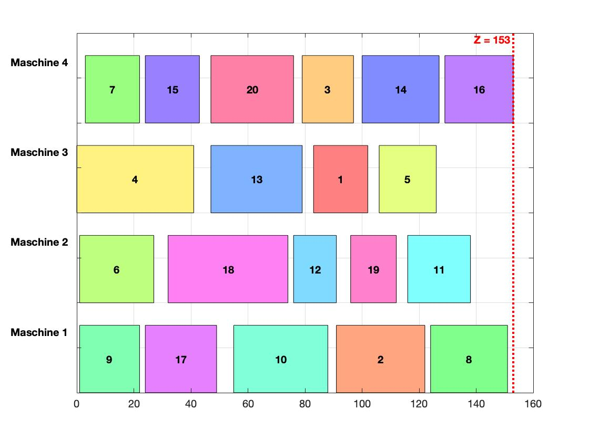

# Parallel Machine Scheduling using Simulated Annealing (NP-Hard)

Goal: Minimal Energy consumption and minimial processing time
Properties: 
- different processing time for each job on each machine
- different sequence dependent setup time for each job on each machine
- different run on-time for each job on each machine 
- different release time for each job

  

# Usage:

### costmain.m:

The simulation of machine allocation is performed in `costmain`. The initial parameters are set as follows:

- `MaxIt`: Number of iterations
- `MaxIt2`: Number of times a new solution per integration is generated and compared (m x n)
  (Calculations were conducted with `MaxIt=200-400` and `MaxIt2=80`)

The objective function `Q=Z*b+(1-b)*E` is specified with `b`.

The initial temperature `T0` and the cooling rate `alpha` depend on the chosen starting function.
Example: (Slight variations may occur on different devices)
  - For b=1: `T0=105`, `alpha=0.8`
  - For b=0.95: `T0=100`, `alpha=0.8`
  - For b=0.8: `T0=100`, `alpha=0.8`
  - For b=0: `T0=500`, `alpha=0.8`

The model with the specified data is generated with `genModel`, and then a random solution is created with `genSol`, followed by calculating its consumption and cycle time with `calcCost`.

The actual optimization starts with `SA`. The initial parameters and solution are passed as input to the function. A new solution is generated from the initial solution with `genNeighbor`, and it is compared with the best solution in terms of the objective function value. This process continues until the maximum number of iterations is reached.

Then, another check is performed:

If only the cycle time/energy consumption is minimized and multiple machine allocation plans have the same minimum cycle time/energy consumption, the function `calcBestTimeandCost` calculates the plan with the lowest energy consumption/cycle time at minimal cycle time/energy consumption.

For other values of `b`, only the minimum objective function `Q` is calculated, and the allocation diagrams are output.

### genModel.m:

`genModel` stores the data of the allocation problem. Calling this function generates a struct `Model`.

### genSol.m:

The first feasible solution is generated here. A matrix `schedule` and a matrix `Order` are created.

In `schedule`, the column number represents the order, and its content represents the allocation of the machine.
Example: `schedule=[2 4 3 ... 2 4 3]`
  - The 1st order is allocated on machine 2, the 2nd order on machine 4, the 3rd order on machine 3, and so on.

In `Order`, the order of the tasks on the machine is specified.
Example: `order=[7 15 9 ... 19 11 14]`
  - Task 1 is allocated in position 7 on machine 2, task 2 in position 15 on machine, task 3 in position 9 on machine 3, and so on.

With these two matrices, a new matrix `L` is developed. This matrix now contains all tasks on one machine in the specified order from `Order`. Then, the zero rows are removed from `L`, and it is converted to a cell, which is stored in `Sol`, just like `schedule` and `order`.

### calcTarget.m:

First, all necessary data from `model` and `sol` are retrieved. Then, the value of the objective function is calculated via the allocation matrix. A machine is only turned on when the first task is released on it, and the setup time for the first task on a machine is assumed to be 0 for simplification. The calculated values are stored again in a struct.

### simulatedannealing.m:

Initially, a new solution is generated from the best solution so far using `genNeighbor`. This new solution is then compared with the previous best solution in terms of the objective function value. If the new solution has a better objective function value, it is accepted as the new best solution. Then, the temperature is reduced, and the process is repeated until the termination criterion is met.

### genNeighbor.m:

In `genNeighbor`, swap and insertion methods are applied to the `order` and `schedule` matrices to generate new solutions.

### calcBestTimeandCost.m:

If multiple plans have the same minimal cycle time/minimum consumption, the function finds the plan with the lowest consumption/lowest time. This allocation plan is then saved as a new solution struct.

### plotLowestCTatminimalCT.m:

Compares objective function values of the old best solution and the new solution from `calcBestTimeandCost.m` and plots the solution with the lower value.

### genPlotTime.m:

Plots the Gantt chart based on the start and end of each task. The setup times and the times a machine waits for task release are the distances between the "blocks" of the individual tasks.

### genPlotCost.m:

Plots the consumption diagram of the machine allocation plan.

The structure of the Simulated Annealing Algorithm and the basic structure of the plots are adopted from Heris, M. K. (2015): Parallel Machine Scheduling using Simulated Annealing, in: [source](https://yarpiz.com/367/ypap107-parallel-machine-scheduling), Accessed on 07.01.2021.
